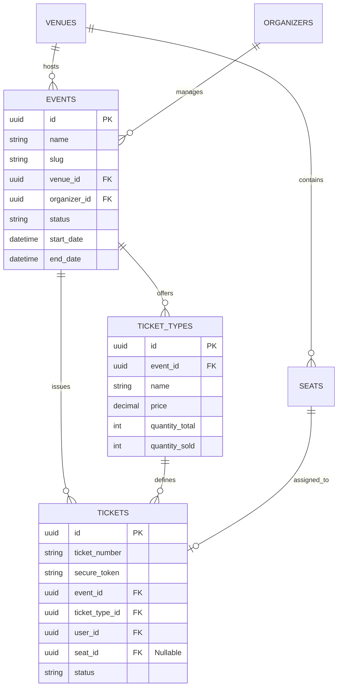

# DESIGN: Master Data Schema Architecture

## Database Schema Diagram (ERD Concept)

## Architectural Decisions

### 1. UUID vs BigInt

- **Decision**: Use UUIDs for all primary keys as requested in PRD (improves security/enumeration prevention, easier for distributed systems).
- **Impact**: All migrations need to use `uuid('id')->primary()`.

### 2. Status Enums

- **Decision**: define PHP Enums for `EventStatus` (`DRAFT`, `PUBLISHED`, `CANCELLED`, `COMPLETED`) and `TicketStatus` (`ACTIVE`, `SCANNED`, `REFUNDED`, `VOID`).
- **Impact**: Type safety in code.

### 3. Inventory Management

- **Decision**: Store `quantity_sold` in `ticket_types` and increment/decrement transactionally.
- **Alternative**: Count `tickets` table query.
- **Reasoning**: Caching count in `ticket_types` improves read performance for checking availability during high traffic.

### 4. Migration Strategy

- Since this is an early stage (or refactor), we will attempt to modify existing tables if possible, but given the switch to UUID primary keys (if not already using them), it might be cleaner to drop/recreate tables if data preservation is not critical (Development env).
- _Observation_: Current `tickets` uses `id()` (bigint) and separate `uuid`. PRD asks for `id` as UUID.
- _Plan_: We will likely perform a destructive migration for the proposal context or try to alter. Recommendations in PRD imply strict UUID PKs. I will follow PRD.
