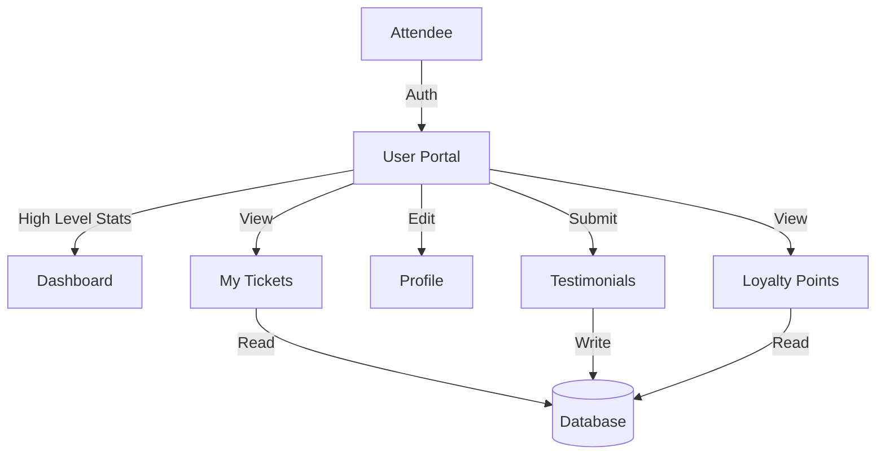

# Design: User Ticket Portal (MVP 1)

## Overview

Architectural decisions and component design for the User Ticket Portal MVP 1, focusing on self-service ticket management and engagement.

## Architecture

### System Context



### Authentication Flow

Standard Laravel Auth with Role Check:

1. **Guest** visits `/login` or `/register`.
2. **Register**: Creates `User` with `role='attendee'`.
3. **Login**: Checks credentials.
4. **Redirect**:
    - `admin` -> `/admin/dashboard`
    - `attendee` -> `/user/dashboard`

## Database Design

### Entity Relationship Diagram

- **User** (1) ---- (N) **Ticket**
- **User** (1) ---- (N) **Testimonial**
- **Ticket** (1) ---- (0..1) **Testimonial**
- **User** (1) ---- (1) **LoyaltyPoint** (or N for history)

### Schema Updates

#### New: `testimonials` Table

```php
Schema::create('testimonials', function (Blueprint $table) {
    $table->id();
    $table->foreignId('user_id')->constrained();
    $table->foreignId('ticket_id')->constrained();
    $table->foreignId('event_id')->constrained();
    $table->integer('rating')->unsigned(); // 1-5
    $table->text('comment')->nullable();
    $table->timestamps();
    $table->unique(['user_id', 'ticket_id']); // One review per ticket
});
```

#### New: `loyalty_points` Table

```php
Schema::create('loyalty_points', function (Blueprint $table) {
    $table->id();
    $table->foreignId('user_id')->constrained();
    $table->integer('points')->default(0);
    $table->string('reason')->nullable(); // e.g., "Ticket Purchase", "Review"
    $table->timestamps();
});
```

#### Modified: `tickets` Table

- Add `user_id` (FK, nullable for backward compat).

#### Modified: `users` Table

- Add `avatar` column.
- Add `role` column (if not exists) or use existing role system.

## Component Design

### Controllers

| Controller | Routes | Responsibility |
| `AuthController` | `/login`, `/register` | Auth logic |
| `User\DashboardController` | `/user/dashboard` | Stats, Points, Upcoming |
| `User\TicketController` | `/user/tickets/*` | List, Detail, Download |
| `User\TestimonialController` | `/user/testimonials` | Submit review |
| `User\ProfileController` | `/user/profile` | Edit details |

### Views (Blade)

- `layouts/user.blade.php`: Sidebar, Navbar.
- `user/dashboard.blade.php`: Widgets.
- `user/tickets/index.blade.php`: Tabs (Upcoming/Past).
- `user/tickets/show.blade.php`: QR Code, details.
- `user/profile/edit.blade.php`: Form.
- `user/testimonials/create.blade.php`: Form (or modal in ticket detail).

## UI/UX Design

- **Framework**: Tailwind CSS + DaisyUI.
- **Theme**: Glassmorphism (matching admin).
- **Responsive**: Mobile-first grid layouts.

## Security

- **Authorization**: Policies (`TicketPolicy`, `TestimonialPolicy`) to ensure users own their data.
- **XSS**: Blade escaping.
- **CSRF**: Laravel defaults.

## Data Migration

- Script to match existing `tickets.user_email` to `users.email` and set `tickets.user_id`.
