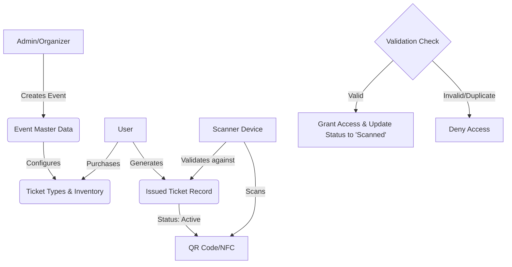

# Product Requirements Document: Master Data Schema for Event Ticketing System

| Metadata           | Details                                       |
| :----------------- | :-------------------------------------------- |
| **Feature Name**   | Master Data Schema for Event Ticketing System |
| **Slug**           | `ticketing-master-data-schema`                |
| **Status**         | Draft                                         |
| **Target Release** | Q2 2026                                       |
| **Owner**          | Product Team                                  |
| **Tech Lead**      | TBD                                           |
| **Design Lead**    | TBD                                           |
| **QA Lead**        | TBD                                           |

## 1. Overview

This PRD outlines the requirements for a comprehensive master data schema to support a robust event ticketing system. The schema will serve as the backbone for event creation, ticket sales, inventory management, user validation, and reporting. It is designed to ensure data integrity, scalability, and seamless integration with scanning devices and payment gateways.

## 2. Background

### 2.1 Context

The current ticketing landscape requires a flexible and secure data structure to handle diverse event types, complex pricing models, and high-volume entry validation. A well-defined schema is critical for enabling features like real-time inventory tracking, prevent fraud (double scanning), and providing rich data for analytics.

### 2.2 Problem Statement

Without a unified and optimized master data schema, the system faces risks of:

- **Data Inconsistency:** Discrepancies between sales and access control data.
- **Scalability Issues:** Inability to handle high-traffic ticket sales launches.
- **Integration Challenges:** Difficulty connecting with third-party scanners and payment providers.
- **Poor User Experience:** inflexible ticket types or seat selection errors.

### 2.3 Objectives

- **Data Integrity:** Establish a single source of truth for all event and ticket data.
- **Performance:** Optimize data structures for fast read/write operations during peak sales and entry scanning.
- **Flexibility:** Support various event configurations (seated, GA, hybrid) and ticket types.
- **Security:** Ensure robust validation mechanisms to prevent fraud.

## 3. Scope

### 3.1 In-Scope (MVP 1) ✅

- **Event Management:** Schema for event details (name, date, time, location, status).
- **Venue & Seating:** Basic venue layout and seat allocation logic.
- **Ticket Configuration:** Ticket types (VIP, GA), pricing tiers, and inventory limits.
- **Ticket Issuance:** Unique identifier generation (UUID/QR code data), purchase metadata.
- **Validation Logic:** Status tracking (valid, scanned, refunded, expired).
- **User Association:** Linking tickets to purchaser accounts.
- **Transaction Records:** Basic payment reference links.

### 3.2 Out-of-Scope (Future) ❌

- **Complex Dynamic Pricing:** Real-time AI-driven price adjustments (basic tiering is in-scope).
- **Interactive Seat Maps:** Visual rendering data (although the schema will support the underlying data).
- **Bundled Products:** Merchandise or add-on sales schema (tickets only for MVP).
- **Resale Marketplace:** Peer-to-peer transfer logic (basic transfer flag is in-scope, marketplace implementation is not).

## 4. User Flow (Data Interaction)

## 5. Master Data Schema Specifications

The following entities and fields are required.

### 5.1 Events Table (`events`)

Stores core details about the event.

| Field Name     | Data Type | Description             | Constraints                                    |
| :------------- | :-------- | :---------------------- | :--------------------------------------------- |
| `id`           | UUID      | Unique Event Identifier | Primary Key                                    |
| `name`         | String    | Event Name              | Not Null                                       |
| `slug`         | String    | URL-friendly name       | Unique, Not Null                               |
| `description`  | Text      | Event Description       | Nullable                                       |
| `start_date`   | DateTime  | Event Start Date & Time | Not Null                                       |
| `end_date`     | DateTime  | Event End Date & Time   | Not Null                                       |
| `venue_id`     | UUID      | Reference to Venue      | Foreign Key                                    |
| `status`       | Enum      | Event Status            | `DRAFT`, `PUBLISHED`, `CANCELLED`, `COMPLETED` |
| `organizer_id` | UUID      | Reference to Organizer  | Foreign Key                                    |
| `created_at`   | DateTime  | Creation Timestamp      | Default Now                                    |
| `updated_at`   | DateTime  | Last Update Timestamp   | Default Now                                    |

### 5.2 Ticket Types Table (`ticket_types`)

Defines the varieties of tickets available for an event (e.g., VIP, General Admission).

| Field Name       | Data Type | Description                      | Constraints    |
| :--------------- | :-------- | :------------------------------- | :------------- |
| `id`             | UUID      | Unique Ticket Type ID            | Primary Key    |
| `event_id`       | UUID      | Reference to Event               | Foreign Key    |
| `name`           | String    | Name (e.g., "Early Bird", "VIP") | Not Null       |
| `description`    | String    | Inclusion details                | Nullable       |
| `price`          | Decimal   | Base Price                       | Not Null, >= 0 |
| `currency`       | String    | Currency Code (USD, EUR)         | Default 'USD'  |
| `quantity_total` | Integer   | Total tickets allocated          | Not Null       |
| `quantity_sold`  | Integer   | Tickets sold so far              | Default 0      |
| `sale_start`     | DateTime  | Sales start time                 | Nullable       |
| `sale_end`       | DateTime  | Sales end time                   | Nullable       |
| `max_per_order`  | Integer   | Max quantity per purchase        | Default 10     |

### 5.3 Seats Table (`seats`) (Optional for GA)

For events with assigned seating.

| Field Name      | Data Type | Description              | Constraints   |
| :-------------- | :-------- | :----------------------- | :------------ |
| `id`            | UUID      | Unique Seat ID           | Primary Key   |
| `venue_id`      | UUID      | Reference to Venue       | Foreign Key   |
| `section`       | String    | Section Name/ID          | Not Null      |
| `row`           | String    | Row Number/ID            | Not Null      |
| `number`        | String    | Seat Number              | Not Null      |
| `is_accessible` | Boolean   | Wheelchair accessibility | Default False |

### 5.4 Issued Tickets Table (`tickets`)

The individual tickets generated upon purchase. This is the table queried during scanning.

| Field Name       | Data Type | Description                        | Constraints                             |
| :--------------- | :-------- | :--------------------------------- | :-------------------------------------- |
| `id`             | UUID      | Unique Database ID                 | Primary Key                             |
| `ticket_number`  | String    | Human-readable ID (e.g., #ABC-123) | Unique                                  |
| `secure_token`   | String    | Encrypted token for QR Code        | Unique, Not Null                        |
| `event_id`       | UUID      | Reference to Event                 | Foreign Key                             |
| `ticket_type_id` | UUID      | Reference to Ticket Type           | Foreign Key                             |
| `user_id`        | UUID      | Reference to Buyer                 | Foreign Key                             |
| `order_id`       | UUID      | Reference to Transaction           | Foreign Key                             |
| `seat_id`        | UUID      | Reference to Seat (if applicable)  | Nullable, Unique per Event              |
| `status`         | Enum      | Current State                      | `ACTIVE`, `SCANNED`, `REFUNDED`, `VOID` |
| `price_paid`     | Decimal   | Actual price paid                  | Not Null                                |
| `scanned_at`     | DateTime  | Time of entry                      | Nullable                                |
| `scanned_by`     | String    | ID of scanner device/user          | Nullable                                |

## 6. User Stories

| ID        | User Story                                                                                                                   | Acceptance Criteria                                                                                                                                                                  | Priority |
| :-------- | :--------------------------------------------------------------------------------------------------------------------------- | :----------------------------------------------------------------------------------------------------------------------------------------------------------------------------------- | :------- |
| **US-01** | As an **Admin**, I want to create an event with multiple ticket types so that I can sell staggered tiers (e.g., Early Bird). | **Given** I am on the event creation page **When** I add a "VIP" ticket type with a price and limit **Then** the system saves the configuration and enforces inventory limits. | High     |
| **US-02** | As a **User**, I want to receive a unique QR code for my ticket data so that I can enter the venue.                          | **Given** I have completed a purchase **When** I view my ticket **Then** I see a QR code generating from the `secure_token` field.                                             | High     |
| **US-03** | As a **Gatekeeper**, I want to scan a ticket and instantly know if it's valid so that I can control entry.                   | **Given** I scan a user's QR code **When** the scanner reads the token **Then** the system checks the `tickets` table status **And** returns "Valid" if status is `ACTIVE`. | High     |
| **US-04** | As a **System**, I want to prevent double-entry so that a ticket cannot be used twice.                                       | **Given** a ticket has status `SCANNED` **When** it is scanned again **Then** the system returns "Already Scanned" and the timestamp of the first scan.                        | High     |

## 7. Analytics & Tracking

| Event                | Trigger               | Data Payload (JSON)                                                  | Description                          |
| :------------------- | :-------------------- | :------------------------------------------------------------------- | :----------------------------------- |
| `listing_viewed`     | User loads event page | `{"event_id": "uuid", "user_id": "uuid"}`                            | Interest tracking.                   |
| `add_to_cart`        | User selects tickets  | `{"event_id": "uuid", "ticket_type": "vip", "qty": 2}`               | Intent to purchase.                  |
| `purchase_completed` | Payment success       | `{"order_id": "uuid", "total": 150.00, "qty": 2}`                    | Conversion tracking.                 |
| `ticket_scanned`     | Scanner API hit       | `{"ticket_id": "uuid", "device_id": "device_01", "result": "valid"}` | Entry throughput and fraud attempts. |

## 8. Requirements for Integration

### 8.1 Scanner Device Requirements

- **Offline Capability:** Scanners must cache valid ticket hashes if network drops (requires sync endpoint).
- **API Endpoint:** `POST /api/v1/tickets/validate`
    - Payload: `{ "token": "string" }`
    - Response: `{ "status": "valid", "ticket": { ... } }` or `{ "error": "duplicate_entry" }`
- **Device Auth:** All scanners must authenticate via API Key.

### 8.2 Payment System Configurations

- **Idempotency:** Webhooks from payment provider (Stripe/PayPal) must be handled idempotently to prevent duplicate ticket generation.
- **Reference Pointers:** `order_id` in `tickets` table must match the Merchant Reference ID in the payment gateway.

## 9. Open Questions

| Question                                                                    | Assignee | Status |
| :-------------------------------------------------------------------------- | :------- | :----- |
| Do we need to support specific PDF ticket generation templates?             | Product  | Open   |
| How long should `secure_token` be valid for dynamic QR codes?               | Tech     | Open   |
| Should we implement soft-locks on seats during checkout (cart reservation)? | Tech     | Open   |

## 10. Notes & Considerations

- **Concurrency:** Implement database row locking or optimistic locking on `inventory` fields to prevent overselling during high-demand drops.
- **Security:** `secure_token` should be a salted hash or a signed JWT to prevent brute-force generation of valid tickets.
- **Timezones:** All `DateTime` fields should be stored in UTC and converted to local event time on the frontend.
