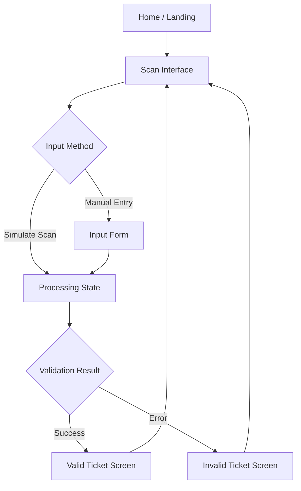

# Product Requirements Document: Ticketing Prototype

| Metadata | Details |
| :--- | :--- |
| **Status** | Draft |
| **Version** | 1.0 |
| **Owner** | Product Management |
| **Date** | 2026-02-04 |
| **Target Release** | Q1 2026 |

## 1. Overview

**Ticketing Prototype** is a high-fidelity web application designed to simulate the core workflows of a barcode-based ticketing system. Its primary purpose is to validate user experience, interface design, and operational flows for event staff and gatekeepers before committing to full-scale backend development.

By focusing on frontend interactions and simulated logic, this prototype serves as a tangible reference point for stakeholders, ensuring that the final product meets usability standards and operational needs.

---

## 2. Quick Links

| Resource | Link |
| :--- | :--- |
| **Design Mockups** | [Figma Prototype Link] |
| **Technical Spec** | [Tech Link placeholder] |
| **Project Board** | [Jira/Trello Link placeholder] |
| **Product Brief** | [Product Brief Link] |

---

## 3. Background

### 3.1 Context
Developing a complex ticketing system solely based on abstract requirements and text-based specifications often leads to misalignment between stakeholder expectations and the final delivery. 

### 3.2 Problem Statement
- **Abstract Logic:** It is difficult to visualize the end-to-end flow of scanning and validation from written specs alone.
- **Late Discovery of UX Issues:** Usability problems discovered during the final QA or UAT phases are expensive and time-consuming to fix.
- **Validation Gap:** There is currently no way to "feel" the product experience on actual devices (mobile/tablet) without a fully functional backend.

### 3.3 Goals
- Create a realistic simulation of the ticket scanning and validation process.
- Validate layouts and interactions on target devices (mobile phones and tablets).
- Gather stakeholder feedback early in the design phase.

---

## 4. Objectives

### 4.1 Business Objectives
1. **Reduce Rework Costs:** Identify and fix interaction issues during the prototype phase rather than post-development.
2. **Accelerate Feedback Loop:** Provide a hands-on tool for stakeholders to validate requirements within 1 week of design approval.
3. **Tech Stack Alignment:** Establish the foundational frontend architecture (Laravel + TailwindCSS) to be used in production.

### 4.2 User Objectives
1. **Operational Confidence:** Enable Event Staff to practice and understand the scanning flow before the actual event.
2. **Efficiency Testing:** Allow Gatekeepers to test the speed and ergonomics of the manual entry vs. scanning workflows.

---

## 5. Success Metrics

| Metric | Baseline | Target | Measurement Method |
| :--- | :--- | :--- | :--- |
| **Scenario Completion Rate** | N/A | 100% | Percentage of users who can successfully "scan" a valid ticket in the prototype. |
| **Feedback Cycles** | 3 rounds | 1 round | Number of design iteration rounds required after prototype demo. |
| **Device Compatibility** | Desktop only | 100% | Verified responsive rendering on Mobile (iOS/Android) and Tablet viewports. |

---

## 6. Scope

### 6.1 In-Scope (MVP) ✅
- **Landing/Home Screen:** Entry point for the simulation.
- **Scan Interface (Simulated):** UI for scanning (visual mock only) and button to trigger "scan".
- **Manual Entry:** Form to input barcode numbers manually.
- **Result Displays:**
  - Valid Ticket (Green state)
  - Invalid/Duplicate Ticket (Red state)
  - Loading states
- **Navigation:** Seamless routing between all screens.
- **Responsive Design:** Mobile-first layout using TailwindCSS.

### 6.2 Out-of-Scope ❌
- **Real Camera Integration:** Utilizing the device camera for actual QR code scanning (future enhancement).
- **Backend API Integration:** No real server validation; results are mocked.
- **User Authentication:** Login/Logout is not required for this simulation.
- **Ticket Generation:** Creating or purchasing tickets.

### 6.3 Future Roadmap
- **Phase 2:** Integration with browser-based camera APIs for "live" scanning.
- **Phase 3:** Configurable mock responses (simulate slow network, server errors).

---

## 7. User Flow



---

## 8. User Stories

| ID | User Story | Acceptance Criteria | Priority |
| :--- | :--- | :--- | :--- |
| **US-01** | As a **Gatekeeper**, I want to see a clear landing page so that I can quickly start the scanning process. | **Given** I open the prototypes URL<br>**Then** I see the Home screen with a clear "Start Scanning" call-to-action.<br>**And** the layout fits my mobile screen. | High |
| **US-02** | As a **Gatekeeper**, I want to simulate a successful ticket scan so that I can see what a "GO" result looks like. | **Given** I am on the Scan Interface<br>**When** I click "Simulate Valid Scan"<br>**Then** I see a loading spinner<br>**And** I am redirected to the "Valid Ticket" result screen<br>**And** I see ticket details (Name, Gate, Seat). | High |
| **US-03** | As a **Gatekeeper**, I want to manually enter a barcode so that I can validate tickets when scanning fails. | **Given** I am on the Scan Interface<br>**When** I select "Manual IO"<br>**Then** I see a numeric keypad or input field<br>**And** I can type a code and hit "Submit". | High |
| **US-04** | As a **Gatekeeper**, I want to see a clear error message for invalid tickets so that I can deny entry efficiently. | **Given** I input a "bad" code (or click "Simulate Invalid")<br>**Then** I see the "Invalid Ticket" screen<br>**And** the background is red<br>**And** a clear reason is displayed (e.g., "Already Scanned"). | High |
| **US-05** | As a **Gatekeeper**, I want to quickly return to the scan screen after a result so I can process the next attendee. | **Given** I am viewing a Result (Valid/Invalid)<br>**When** I click "Scan Next" or wait 3 seconds<br>**Then** I am returned to the Scan Interface. | Medium |

---

## 9. Analytics & Tracking

Although this is a prototype, we will simulate basic event tracking to validate the analytics structure.

| Event Name | Trigger | Properties | Description |
| :--- | :--- | :--- | :--- |
| `scan_attempt` | User clicks "Scan" or submits manual code | `method`: "camera" / "manual" | Tracks the start of a validation attempt. |
| `validation_result` | Result screen loads | `status`: "valid" / "invalid"<br>`code`: [code_value] | Tracks the outcome of the mock validation. |
| `manual_entry_toggle` | User switches to manual input | N/A | Tracks usage of the fallback input method. |

**Example JSON Event:**
```json
{
  "event": "validation_result",
  "properties": {
    "status": "valid",
    "timestamp": "2026-02-04T10:00:00Z",
    "mock_latency_ms": 250
  }
}
```

---

## 10. Open Questions

| Question | Assignee | Status |
| :--- | :--- | :--- |
| Do we need to simulate network latency to test user patience? | UX Designer | Open |
| Should the "Valid" screen auto-dismiss after N seconds? | Product Owner | Proposed (Yes, 3s) |
| Are there specific sound effects needed for Success/Fail? | Design | Open |

---

## 11. Notes & Technical Considerations

- **Tech Stack:** Laravel (Backend/Routing), TailwindCSS (Styling).
- **Environment:** Local development environment (`localhost`) is sufficient for initial testing.
- **Responsiveness:** Critical. The design must be "thumb-friendly" for mobile usage.
- **Mock Data:** Hardcode a set of "valid" and "invalid" codes in the controller logic for consistent testing.

---

## 12. Appendix

### Glossary
- **Gatekeeper:** The staff member holding the device at the venue entrance.
- **High-Fidelity:** A value closely matching the final look and feel, though functionality is simulated.
- **Happy Path:** The default scenario where a ticket is valid and entry is granted.
