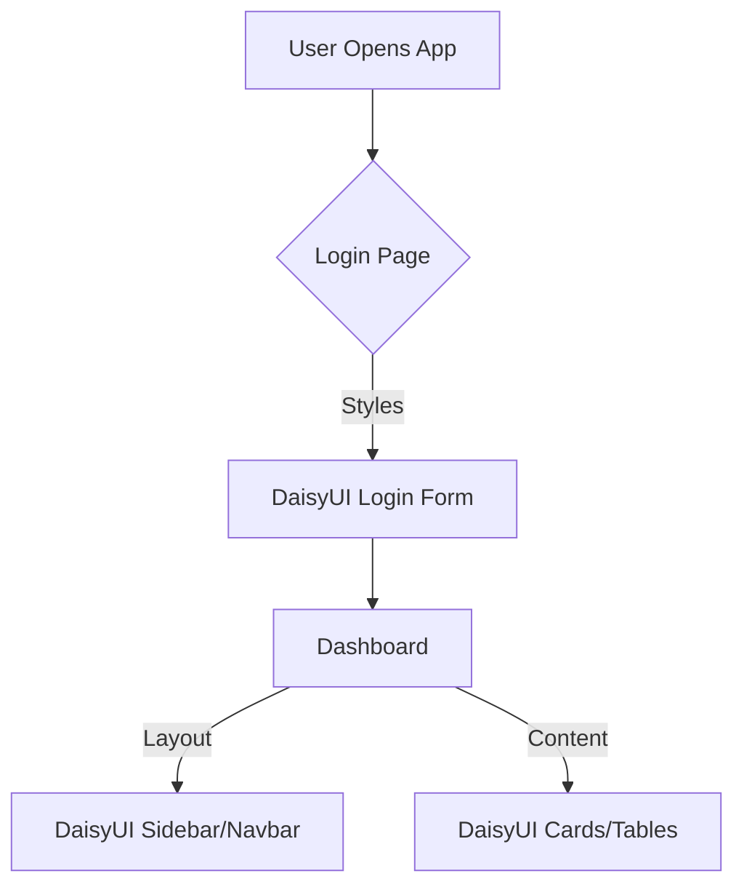

# Product Requirements Document: System-wide UI Modernization with DaisyUI

| Attribute          | Details                                   |
| :----------------- | :---------------------------------------- |
| **Feature Name**   | System-wide UI Modernization with DaisyUI |
| **Status**         | Draft                                     |
| **Target Release** | Q2 2026                                   |
| **Owner**          | Product Team                              |
| **Reviewers**      | Engineering Lead, Design Lead, QA Lead    |
| **Last Updated**   | 2026-02-09                                |

## Quick Links

- [Design System (Figma)](https://example.com/figma)
- [Technical Architecture](https://example.com/tech-spec)
- [Jira Epic](https://example.com/jira-epic)

---

## 1. Background

### Context

The current application utilizes a mix of custom CSS and potentially inconsistent component libraries, leading to a fragmented user experience and significant maintenance overhead. To improve development velocity and ensure visual consistency, we are transitioning the entire UI component library to use [DaisyUI](https://daisyui.com/), a plugin for Tailwind CSS.

### Problem Statement

- **Maintenance Overhead:** Custom CSS styles are difficult to maintain and scale.
- **Inconsistency:** UI elements lack visual uniformity across different modules.
- **Development Speed:** Developers spend excessive time writing custom styles instead of using pre-built utility classes.

### Current State

- The application uses [Existing Styling Method - assumed custom CSS/Bootstrap].
- Maintenance requires deep knowledge of legacy CSS files.
- UI components are not fully responsive or accessible by default.

---

## 2. Objectives

### Business Objectives

1.  **Reduce Maintenance Costs:** Decrease time spent on UI bug fixes by 40%.
2.  **Accelerate Development:** Improve frontend development velocity by 30% through reusable components.
3.  **Ensure Consistency:** Achieve 100% visual consistency across all application modules.

### User Objectives

1.  **Enhanced UX:** Users experience a modern, responsive, and visually cohesive interface.
2.  **Accessibility:** Improved accessibility compliance (WCAG) provided by DaisyUI defaults.
3.  **Performance:** Faster load times due to optimized CSS delivery via Tailwind.

---

## 3. Success Metrics

| Metric                            | Baseline | Target   | Measurement Method | Timeline       |
| :-------------------------------- | :------- | :------- | :----------------- | :------------- |
| Global UI Consistency Score       | 60%      | 100%     | Design Audit       | Post-Migration |
| Average UI Dev Time per Component | 4 hours  | 2 hours  | Jira Time Tracking | Post-Migration |
| CSS Bundle Size                   | [X] KB   | < [X] KB | Build Analysis     | Post-Migration |
| Accessibility Score (Lighthouse)  | 70       | 95+      | Lighthouse Audit   | Post-Migration |

---

## 4. Scope

### MVP 1: Core Component Replacement (In-Scope ✅)

- [ ] Install and configure Tailwind CSS and DaisyUI.
- [ ] Define global theme (colors, typography) within `tailwind.config.js`.
- [ ] Replace core form elements (Input, Select, Checkbox, Radio, Toggle).
- [ ] Replace navigation elements (Navbar, Sidebar, Breadcrumbs).
- [ ] Replace buttons and action elements.
- [ ] Replace layout containers (Cards, Modals, Alerts).
- [ ] Verify responsiveness on Mobile, Tablet, and Desktop.

### Out of Scope (❌)

- Major UX workflow redesigns (focus is on UI replacement, not flow changes).
- Backend API changes.
- Third-party library replacements (unless strictly UI-related).

### Future Roadmap

- Dark mode implementation (if not in MVP).
- Advanced animations and micro-interactions.
- Custom DaisyUI theme generator for clients.

---

## 5. User Flow

The user flow remains largely unchanged as this is a UI refactor. However, the visual interaction will be updated.



---

## 6. User Stories

| ID        | User Story                                                                             | Acceptance Criteria                                                                                                                                                                                                  | Priority | Platform   |
| :-------- | :------------------------------------------------------------------------------------- | :------------------------------------------------------------------------------------------------------------------------------------------------------------------------------------------------------------------- | :------- | :--------- |
| **US-01** | As a developer, I want to configure DaisyUI so that I can use its components globally. | **Given** the project relies on Tailwind<br>**When** I check `package.json` and `tailwind.config.js`<br>**Then** DaisyUI is listed and configured as a plugin<br>**And** the default theme matches brand guidelines. | High     | Web        |
| **US-02** | As a user, I want to see consistent button styles so that I know what is clickable.    | **Given** I am on any page<br>**When** I see a primary action<br>**Then** it uses the `btn btn-primary` class<br>**And** has consistent padding, hover effects, and focus states.                                    | High     | Web        |
| **US-03** | As a user, I want responsive tables so that I can view data on mobile.                 | **Given** I am viewing a data grid<br>**When** I resize the screen to mobile width<br>**Then** the table adapts (e.g., horizontal scroll or stack)<br>**And** styles remain broken-free using DaisyUI table classes. | Medium   | Mobile/Web |
| **US-04** | As a developer, I want all input fields to be standardized.                            | **Given** I am building a form<br>**When** I use the `input` class<br>**Then** the field has consistent borders, focus rings, and error states.                                                                      | High     | Web        |
| **US-05** | As a user, I want clear feedback messages.                                             | **Given** I perform an action<br>**When** a success or error occurs<br>**Then** a DaisyUI `alert` component appears<br>**And** it is dismissible and colored correctly (Green/Red).                                  | Medium   | Web        |

---

## 7. Analytics & Tracking

This refactor should not break existing analytics, but visual interactions can be tracked.

| Event Name              | Trigger | Properties                                           | Description                               |
| :---------------------- | :------ | :--------------------------------------------------- | :---------------------------------------- |
| `theme_toggle`          | Click   | `{"mode": "dark" \| "light"}`                        | User toggles theme (if implemented).      |
| `component_interaction` | Click   | `{"component": "btn-primary", "location": "header"}` | Tracking engagement with new UI elements. |

**Example JSON Event:**

```json
{
    "Trigger": "Click",
    "TriggerValue": "Save Button",
    "Page": "Settings",
    "Data": {
        "ComponentType": "btn-primary",
        "Theme": "Corporate-Light"
    }
}
```

---

## 8. Open Questions

| Question                                                           | Stakeholder   | Status        |
| :----------------------------------------------------------------- | :------------ | :------------ |
| Should we implement Dark Mode in MVP?                              | Product Owner | Open          |
| Are there specific legacy browser requirements?                    | Tech Lead     | Open          |
| Do we need a custom prefix for DaisyUI classes to avoid conflicts? | Tech Lead     | Resolved (No) |

---

## 9. Notes & Considerations

### Technical Considerations

- **Bundle Size:** Ensure we purge unused styles in production build.
- **Migration Strategy:** Consider a strangler fig pattern—migrating page by page or component by component rather than a "big bang" rewrite if the app is large.
- **Customization:** DaisyUI facilitates theme customization via `tailwind.config.js`. Define the color palette early.

### Business Considerations

- **Training:** Developers might need a brief ramp-up on DaisyUI class names, though standard Tailwind knowledge applies.

---

## 10. Appendix

### Glossary

- **DaisyUI:** A component library for Tailwind CSS.
- **Tailwind CSS:** A utility-first CSS framework.
- **WCAG:** Web Content Accessibility Guidelines.

### References

- [DaisyUI Documentation](https://daisyui.com/docs/use/)
- [Tailwind CSS Documentation](https://tailwindcss.com/docs)
