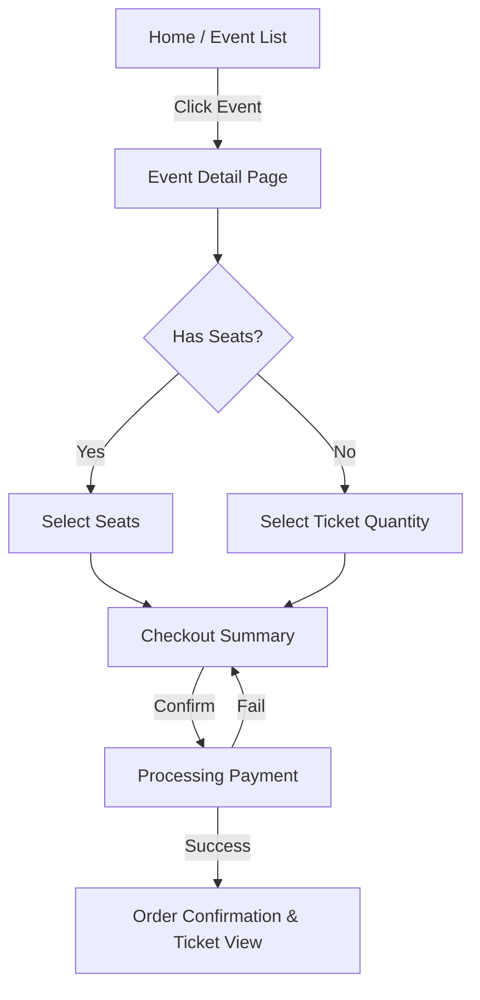

# Product Requirements Document: User Event Discovery & Purchase

| Metadata           | Details                         |
| :----------------- | :------------------------------ |
| **Feature Name**   | User Event Discovery & Purchase |
| **Slug**           | `user-event-discovery`          |
| **Status**         | Draft                           |
| **Target Release** | MVP 1.0                         |
| **Owner**          | Product Team                    |

## 1. Quick Links

- [Design Mockups](TBD)
- [Technical Specifications](../changes/implement-master-data-schema/design.md)
- [Project Context](../project.md)

## 2. Background

### 2.1 Context

We have recently implemented a robust Master Data Schema (Events, Venues, Organizers, Ticket Types, Seats) to replace the previous flat-structure system. This backend infrastructure provides the foundation for advanced inventory management and relationship handling. However, the current user interface does not yet utilize these new capabilities.

### 2.2 Problem Statement

Users currently lack a comprehensive interface to:

1.  Browse events with rich details (Venue, Organizer).
2.  Select specific ticket types with real-time availability.
3.  Select assigned seats (where applicable).
4.  Purchase tickets using the new secure token system.

### 2.3 Current State

- Backend: Master Data Schema implemented (`events`, `venues`, `organizers`, `ticket_types`, `seats`).
- Frontend: Limited or legacy views that do not reflect the new data structure.

## 3. Objectives

### 3.1 Business Objectives

- **Increase Ticket Sales**: By providing a seamless and informative browsing and purchasing experience.
- **Enhance Data Integrity**: Ensure all purchases are correctly linked to Venues, Organizers, and specific Ticket Types/Seats.

### 3.2 User Objectives

- **Discovery**: Easily find events by browsing or searching.
- **Information**: Access complete event details, including location (Venue) and host (Organizer).
- **Choice**: Select preferred ticket categories and seats.
- **Convenience**: Smooth checkout process with immediate ticket issuance.

## 4. Success Metrics

| Metric                    | Baseline | Target  | Measurement Method                            |
| :------------------------ | :------- | :------ | :-------------------------------------------- |
| **Conversion Rate**       | N/A      | > 3%    | (Purchases / Event View Sessions) \* 100      |
| **Avg. Time to Purchase** | N/A      | < 3 min | Time from Event Page Load to Checkout Success |
| **Cart Abandonment Rate** | N/A      | < 60%   | (Carts Created - Purchases) / Carts Created   |

## 5. Scope

### 5.1 In-Scope (MVP 1) ✅

- **Event Listing Page**: Display all `PUBLISHED` events with basic info (Name, Organizer, Date, Price Range).
- **Event Detail Page**: Rich page using `slug` for URLs, showing Venue details, full description, and Ticket Types.
- **Ticket Selection**: Interface to select quantity of tickets per `ticket_type`.
- **Inventory Check**: Prevent validation if `quantity_sold` >= `quantity_total`.
- **Seat Selection (Basic)**: For seated events, allow selecting available seats from a list.
- **Checkout Flow**: Simple purchase initiation (mock payment for MVP) that creates `Ticket` records with `secure_token`.
- **Guest/User Support**: Support for logged-in users (link to existing User ID).

### 5.2 Out-of-Scope ❌

- Visual Seat Map (Phase 2).
- Complex Search/Ordering (Filtering by Date/Category - Phase 2).
- Organizer Dashboard (Separate Epic).
- Real-time Payment Gateway Integration (Use mock for now).

## 6. User Flow



## 7. User Stories

| ID        | User Story                                                                                       | Acceptance Criteria                                                                                                                                                                   | Platform |
| :-------- | :----------------------------------------------------------------------------------------------- | :------------------------------------------------------------------------------------------------------------------------------------------------------------------------------------ | :------- |
| **US-01** | As a **User**, I want to browse upcoming events so that I can decide what to attend.             | **Given** I am on the home page<br>**Then** I see a list of `PUBLISHED` events<br>**And** each card shows Event Name, Date, Venue, and "Starting At" price.                           | Web      |
| **US-02** | As a **User**, I want to view event details so I know more about the venue and organizer.        | **Given** I click an event card<br>**Then** I am taken to `/events/{slug}`<br>**And** I see the Description, Venue Name/City, and Organizer Name.                                     | Web      |
| **US-03** | As a **User**, I want to see available ticket types so I can choose the one that fits my budget. | **When** I am on the Event Detail page<br>**Then** I see list of `TicketTypes` (e.g., VIP, Regular)<br>**And** unavailable types are marked "Sold Out".                               | Web      |
| **US-04** | As a **User**, I want to select specific seats for seated events so I can sit where I want.      | **Given** the event has assigned seating<br>**When** I select a ticket type<br>**Then** I can choose from available `Seats` linked to that venue/section.                             | Web      |
| **US-05** | As a **User**, I want to purchase tickets so I can attend the event.                             | **When** I confirm my selection<br>**Then** a `Ticket` record is created for me<br>**And** it has a unique `secure_token`<br>**And** the `TicketType` `quantity_sold` is incremented. | Web      |

## 8. Analytics & Tracking

```json
{
    "Event": "ViewContent",
    "Properties": {
        "content_type": "product",
        "content_ids": ["{event_uuid}"],
        "content_name": "{event_name}",
        "content_category": "{event_category}"
    }
}
```

```json
{
    "Event": "InitiateCheckout",
    "Properties": {
        "content_ids": ["{event_uuid}"],
        "num_items": 2,
        "value": 50.0,
        "currency": "USD"
    }
}
```

## 9. Open Questions

| Question                                              | Assignee      | Status                                       |
| :---------------------------------------------------- | :------------ | :------------------------------------------- |
| Should we allow guest checkout or force registration? | Product Owner | **Open** (Assume Force Registration for MVP) |
| How long do we hold reserved seats during checkout?   | Tech Lead     | **Open** (15 mins proposed)                  |

## 10. Technical Considerations

- **UUIDs**: All routing and lookups must use UUIDs or Slugs, never integer IDs.
- **Security**: Ticket generation must use the `secure_token` logic defined in the backend task.
- **Performance**: `TicketType` availability can be cached, but strictly validated at checkout.
