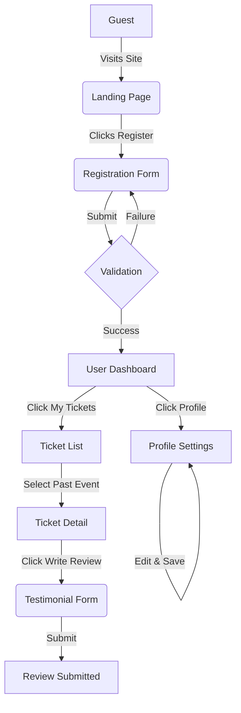

# Product Requirements Document: User Ticket Portal

| Metadata           | Details                                        |
| :----------------- | :--------------------------------------------- |
| **Feature Name**   | User Ticket Portal (Self-Service & Engagement) |
| **Status**         | Draft                                          |
| **Target Release** | Q1 2026                                        |
| **Product Owner**  | TBD                                            |
| **Design Lead**    | TBD                                            |
| **Tech Lead**      | TBD                                            |
| **QA Lead**        | TBD                                            |

---

## 1. Overview

The **User Ticket Portal** is a dedicated, self-service interface for event attendees. It empowers users to manage their own accounts, view their ticket history, and engage with the platform by providing testimonials for past events. This portal is distinct from the administrative backend, focusing on a premium, user-centric experience.

## 2. Quick Links

- [Design Mockups (TBD)](#)
- [Technical Specifications (TBD)](#)
- [Project Timeline (TBD)](#)

---

## 3. Background

### Context

Currently, user management is heavily reliant on the administrative interface (`admin.users.index`), which is designed for staff and volunteers. There is no dedicated space for regular users (attendees) to register themselves, manage their profiles, or provide feedback on events they have attended.

### Problem Statement

- **User Friction:** Users cannot register themselves easily; they rely on admin creation or simple ticket purchase flows.
- **Lack of Engagement:** There is no mechanism for users to provide feedback or testimonials after an event, known as "social proof" for future sales.
- **Admin Dependency:** Staff must manually handle user data updates, increasing workload.
- **Limited User Visibility:** Users have limited visibility into their profile details beyond just a ticket list.

### Goals

- Create a seamless **Self-Service Registration** flow.
- Establish a **User Profile** section for personal data management.
- Implement a **Testimonial System** for past events.
- enhance the existing **Ticket View** (`user.tickets.index`) into a comprehensive portal.

---

## 4. Objectives

### Business Objectives

1.  **Reduce Support Costs:** Decrease admin time spent on user data management by 40% through self-service tools.
2.  **Increase User Engagement:** Collect at least 15% of attendees' testimonials for past events to use in marketing.
3.  **Improve Data Accuracy:** Ensure user information is up-to-date by allowing direct user edits.

### User Objectives

1.  **Convenience:** Easily register and manage my account without contacting support.
2.  **Access:** View all my past and upcoming tickets in one place.
3.  **Voice:** Share my experience through testimonials and ratings.

---

## 5. Success Metrics

| Metric                          | Baseline        | Target            | Measurement Method                                       |
| :------------------------------ | :-------------- | :---------------- | :------------------------------------------------------- |
| **Self-Registration Rate**      | 0% (Admin Only) | 80% of new users  | Database count of self-registered vs admin-created users |
| **Testimonial Submission Rate** | 0%              | 15% of attendees  | (Testimonials Submitted / Tickets Used) \* 100           |
| **Profile Edit Frequency**      | N/A             | 5% of users/month | Analytics on "Update Profile" actions                    |

---

## 6. Scope

### MVP 1 (In Scope) ✅

- [ ] **User Registration:** Public-facing registration page with email/password.
- [ ] **User Login:** Secure login for registered users (separate from Admin login if necessary, or shared auth with role checks).
- [ ] **User Profile:** View and Edit profile (Name, Email, Password, Avatar).
- [ ] **My Tickets:** Enhanced list of Upcoming and Past tickets (Building on `user.tickets.index`).
- [ ] **Testimonials:** Ability to write a review/testimonial for a _past_ event ticket.
- [ ] **Dashboard:** A central hub showing key stats (e.g., "3 Upcoming Events").
- [ ] **Social Sharing:** Share testimonials on social media.
- [ ] **Loyalty Program:** Loyalty Points / Rewards System.

### Out of Scope ❌

- Social Features (Friend requests, sharing).
- Complex Gamification.
- Ticket Resale Platform.

### Future Roadmap

- **Phase 2:** Social sharing of testimonials.
- **Phase 3:** Loyalty program integration.

---

## 7. User Flow



---

## 8. User Stories

| ID        | User Story                                                                           | Acceptance Criteria                                                                                                                                                           | Priority |
| :-------- | :----------------------------------------------------------------------------------- | :---------------------------------------------------------------------------------------------------------------------------------------------------------------------------- | :------- |
| **US-01** | As a Guest, I want to register for an account so I can access the platform services. | **Given** I am on the registration page<br>**When** I enter valid email, name, and password<br>**Then** a new account is created and I am logged in.                          | High     |
| **US-02** | As a Registered User, I want to view and edit my profile details.                    | **Given** I am on the Profile page<br>**When** I update my name or avatar<br>**Then** the changes are saved and visible immediately.                                          | Medium   |
| **US-03** | As a User, I want to distinguish between upcoming and past events.                   | **Given** I am on the My Tickets page<br>**When** I view the list<br>**Then** tickets are categorized by "Upcoming" and "Past" status.                                        | High     |
| **US-04** | As a User, I want to leave a testimonial for an event I attended.                    | **Given** I have a ticket for a past event<br>**When** I navigate to the ticket details<br>**Then** I see a "Write Review" button.<br>**And** I can submit a rating and text. | High     |
| **US-05** | As a User, I want to see my review status.                                           | **Given** I have submitted a review<br>**When** I view the ticket<br>**Then** I see my submitted review instead of the form.                                                  | Medium   |

---

## 9. Analytics & Tracking

| Event Name              | Trigger                                     | Properties                                        | Description                           |
| :---------------------- | :------------------------------------------ | :------------------------------------------------ | :------------------------------------ |
| `user_registered`       | User successfully submits registration form | `source` (web/mobile), `method` (email)           | Track new user growth.                |
| `profile_updated`       | User saves changes to profile               | `fields_changed` (array)                          | Monitor user engagement with profile. |
| `testimonial_submitted` | User submits a review                       | `event_id`, `rating` (1-5), `length` (char count) | Measure engagement and sentiment.     |
| `ticket_viewed`         | User views ticket details                   | `ticket_id`, `status` (upcoming/past)             | Track ticket usage visibility.        |

### JSON Event Example

```json
{
    "Event": "testimonial_submitted",
    "UserId": "u_12345",
    "Timestamp": "2026-06-15T14:30:00Z",
    "Properties": {
        "event_id": "evt_9876",
        "rating": 5,
        "has_text": true,
        "review_length": 142
    }
}
```

---

## 10. Open Questions

| Question                                                                                        | Assignee      | Status |
| :---------------------------------------------------------------------------------------------- | :------------ | :----- |
| Should user accounts strictly be separate from admin accounts (different tables) or just roles? | Tech Lead     | Open   |
| Do we need email verification before allowing login?                                            | Product Owner | Open   |
| Should testimonials be auto-approved or require admin moderation?                               | Product Owner | Open   |

---

## 11. Notes & Considerations

### Technical Considerations

- **Authentication:** Leverage Laravel's built-in auth but ensure the `User` model distinguishes between `admin`/`staff` roles and regular `attendee` roles (or uses a permission system).
- **Database:** Need a new `testimonials` or `reviews` table linked to `events` and `users`.
- **UI/UX:** Must move away from the current Admin dashboard look. Use the glassmorphism/modern aesthetic evident in `user.tickets.index`.

### Design Guidelines

- **Aesthetic:** Dark/Light mode compatible, premium feel (glassmorphism), vibrant accents.
- **Responsiveness:** Mobile-first approach as users will likely access tickets on phones at the venue.

---

## 12. Appendix

### Glossary

- **Guest:** A visitor who has not logged in.
- **Attendee:** A registered user who holds at least one ticket.
- **Testimonial:** Public feedback provided by an attendee after an event.
